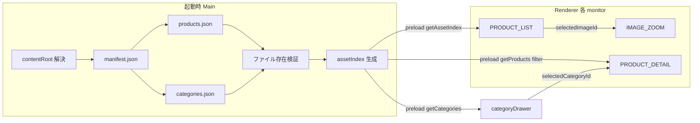

# architecture.md（実施設計）

> Phase 1（自社実装）の設計根拠。機能挙動の正は `docs/Design_Check0622.mp4` / `docs/screen-flow.json`。
> 未決はローカル `docs/open-questions.md`（Git 管理外）を参照。

## 1. 目的・スコープ

4台タッチモニター向け探索体験を、**Electron + Web** で実装し、Windows 現場 PC 上の `.exe` として運用する。

| 項目 | 方針 |
|------|------|
| UI / ロジック | Web 技術（HTML / CSS / TypeScript 等） |
| パッケージ | Windows 向け Electron |
| 運用 | 現場 PC で `.exe` 起動。必要に応じてバッチ / Windows スタートアップで毎日起動 |
| コンテンツ | **Electron ビルドに含めない**。実行ファイル横の外部 `content/` から読み込む |
| MVP | サーバー・DB 不要。ローカル `content/` のみで動作 |
| 将来 | 遠隔素材更新は **MUST ではない**。`content/` 差し替え・同期で拡張可能な設計 |

## 2. 確定しているアプリ挙動（実装前提）

| 項目 | 内容 |
|------|------|
| screenState | `TOP`, `ANIMATION`, `PRODUCT_LIST`, `IMAGE_ZOOM`, `PRODUCT_DETAIL` |
| CATEGORY | 独立 screenState ではない。`PRODUCT_LIST` + `categoryDrawer: open/closed` |
| PRODUCT_LIST | 暗背景・浮遊画像。外部 `content/` / `assetIndex` から画像取得 |
| IMAGE_ZOOM | `PRODUCT_LIST` 画像タップ → 白 overlay。× → `PRODUCT_LIST` |
| PRODUCT_DETAIL | categoryDrawer 選択 → 白詳細/カルーセル。× → `PRODUCT_LIST` |
| TRUNK ロゴ | 装飾のみ。タップハンドラなし |
| 4面同期 | `TOP` → `ANIMATION` → `PRODUCT_LIST`。全台 `TOP` 時のみ開始 |
| モニター独立 | `PRODUCT_LIST` 以降は各 window 独立。1台の無操作 TOP 復帰は他台を巻き込まない |
| 無操作 | 10分。当該モニターのみ `TOP`。タップ・スワイプ・ピンチ・スクロールでリセット |

詳細遷移は `docs/screen-flow.json` を参照。

## 3. 推奨アーキテクチャ概要

```text
┌─────────────────────────────────────────────────────────────┐
│  Windows PC（1台・4ディスプレイ）                              │
│                                                             │
│  TRUNK.exe（Electron）          content/（外部・差し替え可）   │
│  ┌─────────────────────┐       ┌─────────────────────────┐ │
│  │ Main Process        │ read  │ manifest.json           │ │
│  │ - contentRoot 解決   │◄──────│ categories.json         │ │
│  │ - JSON 読込・検証    │       │ products.json           │ │
│  │ - assetIndex 生成   │       │ images/ videos/ thumbs/ │ │
│  │ - 4× BrowserWindow  │       └─────────────────────────┘ │
│  │ - 同期（TOP→LIST）   │                                     │
│  │ - ログ              │                                     │
│  └─────────┬───────────┘                                     │
│            │ preload（安全 API のみ）                          │
│  ┌─────────▼───────────┐ ×4                                  │
│  │ Renderer（Web UI）   │                                     │
│  │ - screenState 管理   │                                     │
│  │ - タッチ / 描画      │                                     │
│  │ - assetIndex 表示    │                                     │
│  └─────────────────────┘                                     │
└─────────────────────────────────────────────────────────────┘
```

**原則**

- 表示は常にローカル `content/` から行う（ネットワーク非依存）
- `assetIndex` は起動時に Main で一度生成。Renderer は描画中に FS を触らない
- 各 Renderer は `monitorId` 単位で状態を独立保持

## 4. 推奨フォルダ構成

### 4.1 リポジトリ（開発時）

```text
TRUNK_delivery/
├── README.md
├── docs/                    # 仕様・設計（現状）
├── assets/.gitkeep          # リポジトリ内プレースホルダ（顧客素材は含めない）
├── content/                 # サンプル用外部コンテンツ（実装 Phase 2 で追加）
│   ├── README.md
│   ├── manifest.json
│   ├── categories.json
│   ├── products.json
│   ├── images/
│   ├── videos/
│   └── thumbs/
└── app/                     # Electron アプリ（実装 Phase 2 以降で追加予定）
    ├── package.json
    ├── electron/
    │   ├── main.ts
    │   ├── preload.ts
    │   └── content/
    │       ├── contentRoot.ts
    │       ├── manifestLoader.ts
    │       ├── assetIndexBuilder.ts
    │       └── validators.ts
    └── renderer/
        ├── index.html
        ├── state/
        ├── screens/
        └── sync/
```

### 4.2 現場デプロイ（パッケージ後）

```text
C:\TRUNK\
├── TRUNK.exe              # または release フォルダ一式
├── content/               # 実行ファイル横（差し替え対象）
│   ├── manifest.json
│   ├── categories.json
│   ├── products.json
│   ├── images/
│   │   ├── list/
│   │   ├── food/
│   │   ├── gift/
│   │   └── flower/
│   ├── videos/
│   │   ├── top/
│   │   ├── animation/
│   │   └── cm/
│   └── thumbs/
└── logs/                  # 任意（Main が出力）
```

**contentRoot 解決**

| 環境 | デフォルト |
|------|------------|
| 開発 | リポジトリルート `./content` |
| パッケージ後 | `process.execPath` のディレクトリ横 `./content` |
| 上書き | 環境変数 `TRUNK_CONTENT_ROOT`（任意） |

## 5. 外部 content/ データモデル

### 5.1 manifest.json

```json
{
  "version": "2026-07-04-001",
  "updatedAt": "2026-07-04T15:00:00+09:00",
  "categoriesFile": "categories.json",
  "productsFile": "products.json",
  "assetBaseDir": ".",
  "defaultListImageDir": "images/list",
  "cmVideoDir": "videos/cm"
}
```

### 5.2 categories.json

```json
[
  {
    "id": "food",
    "label": "FOOD",
    "description": "Food category",
    "imageDir": "images/food",
    "order": 1
  }
]
```

### 5.3 products.json

```json
[
  {
    "id": "food_001",
    "categoryId": "food",
    "title": "Product Name",
    "subtitle": "Short copy",
    "description": "Product description text.",
    "images": ["images/food/food_001_01.jpg"],
    "thumbnail": "thumbs/food/food_001_01.jpg",
    "tags": ["food"]
  }
]
```

### 5.4 assetIndex（Main 起動時生成・メモリ保持）

```text
AssetIndex {
  version: string
  listImages: ListImageEntry[]      // PRODUCT_LIST 用（40〜70枚選定）
  categories: CategoryEntry[]
  products: ProductEntry[]
  fileUrlMap: Map<relativePath, file://...>  // preload 経由で Renderer に URL 化
}
```

## 6. データフロー（content → 画面）



| 画面 | データソース | 備考 |
|------|--------------|------|
| `PRODUCT_LIST` | `assetIndex.listImages` | 起動時選定済み。描画中スキャン禁止 |
| `IMAGE_ZOOM` | 選択中 `listImage` の高解像度パス | 遅延読み込み可 |
| `categoryDrawer` | `assetIndex.categories` | ラベルは JSON から。ハードコード禁止 |
| `PRODUCT_DETAIL` | `products` を `categoryId` でフィルタ | 空状態 UI を用意 |

## 7. Electron 責務分担

### 7.1 Main Process

| 責務 | 内容 |
|------|------|
| contentRoot | 解決・存在確認 |
| データ読込 | `manifest.json` → `categories.json` / `products.json` |
| 検証 | JSON スキーマ・参照ファイル存在 |
| assetIndex | 起動時一度生成 |
| ウィンドウ | ディスプレイごとに `BrowserWindow`（fullscreen / kiosk） |
| 初期データ注入 | `monitorId` + `assetIndex` を preload 経由で Renderer へ |
| 4面同期 | `TOP` → `ANIMATION` → `PRODUCT_LIST`（全台 TOP 時のみ） |
| 4面同期 IPC（MVP） | **Electron Main を中央管理**。Renderer → preload → Main → IPC → 各 BrowserWindow。**WebSocket/UDP 不要** |
| ログ | ファイル + コンソール |
| 拡張ポイント | 将来の `content_next/` 同期フック（MVP では未実装） |

### 7.2 Preload

Renderer に **安全な API のみ** 公開。生 `fs` / `require` は渡さない。

| API | 用途 |
|-----|------|
| `getConfig()` | `monitorId`, `contentRoot`, 開発フラグ |
| `getManifest()` | manifest 内容 |
| `getCategories()` | categories 配列 |
| `getProducts()` | products 配列 |
| `getAssetIndex()` | 起動時生成済み index |
| `getContentFileUrl(relativePath)` | `file://` またはカスタムプロトコル URL |
| `logEvent(event)` | Main へ構造化ログ |
| `onSyncMessage(cb)` | 4面同期イベント受信（Phase 7） |
| `sendSyncMessage(msg)` | 4面同期イベント送信（Phase 7） |

**4面同期 IPC（MVP・確定）**

```text
Renderer A ──preload──► Main Process ◄──preload── Renderer B..D
                            │
                            └── ipcMain / webContents.send で必要 window へ配信
```

| 項目 | MVP |
|------|-----|
| 構成 | 1 PC / 1 Electron / 4 BrowserWindow / 4 タッチモニター |
| 方式 | Electron IPC（Main 中央管理） |
| WebSocket / UDP | **不使用**（複数 PC 構成時の拡張候補） |

### 7.3 Renderer（Web App）

| 責務 | 内容 |
|------|------|
| 画面 | `TOP` / `ANIMATION` / `PRODUCT_LIST` / `IMAGE_ZOOM` / `PRODUCT_DETAIL` |
| uiState | `categoryDrawer` 開閉 |
| 入力 | タッチ・ピンチ・スワイプ |
| 状態 | **モニター（window）単位**で `screenState` 等を保持 |
| 無操作 | 10分タイマー（当該 window のみ） |
| 禁止 | FS 直接アクセス、フォルダスキャン、他 window 状態の上書き |

**PRODUCT_LIST 描画方式（未決・後工程で重点検討）**

`PRODUCT_LIST` は本アプリ最重要画面（体験・デザインの中心）。**Phase 2 では描画方式に手を付けない。**
全ワークフローの約 70% を LIST 検討・試作・調整に割く前提。

後工程で技術比較・簡易デモ検証の上、方式を決定する。候補例:

- DOM / CSS
- Canvas 2D
- PixiJS / WebGL
- Three.js / WebGL
- Unity で LIST 画面自体を作る案
- Unity 演出素材のみ → Electron 表示
- TouchDesigner 等外部アプリ連携
- 外部レンダリング素材を Electron + Web に組み込む案

比較観点: デザイン表現力、40〜70枚性能、タッチ操作、パン/ピンチ、ランダム配置、奥行き演出、グレースケール、content 連携、4面表示、保守性、現場安定性 等。

## 8. モニター単位状態モデル

```text
MonitorState {
  monitorId: 1 | 2 | 3 | 4
  screenState: 'TOP' | 'ANIMATION' | 'PRODUCT_LIST' | 'IMAGE_ZOOM' | 'PRODUCT_DETAIL'
  categoryDrawer?: 'open' | 'closed'       // screenState=PRODUCT_LIST 時
  scrollSection?: 'DETAIL_SECTION_1' | 'DETAIL_SECTION_2'
  selectedImageId?: string
  selectedCategoryId?: string
  selectedProductId?: string
  exploreView?: { panX, panY, zoom }       // PRODUCT_LIST カメラ
  idleTimerMs: number                      // リセット用
}
```

**Global（Main または共有 Sync レイヤ）**

```text
SyncState {
  allMonitorsTop: boolean                  // TOP→ANIMATION 可否
  syncedPhase: 'idle' | 'animating' | 'independent'
}
```

## 9. パフォーマンス要件

| 要件 | 対策 |
|------|------|
| 描画中の FS スキャン禁止 | `assetIndex` を起動時生成 |
| 40〜70枚の LIST | サムネ / 最適化画像を index に登録 |
| ZOOM / DETAIL | 高解像度は選択時に遅延読み込み |
| UI スレッドブロック禁止 | 画像 decode は `createImageBitmap` / 非同期 |
| 低遅延タッチ | input → rAF 内 state 更新 |
| 60fps 目標 | Canvas / WebGL または DOM+transform（実装時選定） |

## 10. 想定リスクと対策

| リスク | 対策 |
|--------|------|
| `content/` 欠落・不正 JSON | 起動時に Main で検証。わかりやすいエラー画面 |
| 参照ファイル欠落 | バリデーション + warning ログ + placeholder |
| 4 window 状態の競合 | `PRODUCT_LIST` 以降は IPC 同期しない |
| 1台のみ TOP で他台探索中 | `allMonitorsTop` ガードで部分同期を防止 |
| 大容量画像でメモリ圧迫 | LIST は thumb、ZOOM/DETAIL は按需 load |
| Electron セキュリティ | `contextIsolation: true`, `nodeIntegration: false`, preload のみ |
| 顧客素材の誤コミット | `.gitignore` + `content/` は現場配置 |
| パッケージ後 path ずれ | `contentRoot` を exec 基準で統一 |

## 11. MVP 実装工程（推奨順）

| Phase | 内容 | 状態 |
|-------|------|------|
| **1** | 設計ドキュメント整備 | 完了 |
| **2** | 外部 content 読み込みレイヤ | **実装済**（`app/electron/content/`） |
| **3** | 確定状態遷移の接続 | 未着手 |
| **4** | 10分無操作スリープ | モニター単位タイマー |
| **5** | PRODUCT_LIST ← assetIndex | LIST **描画方式決定後** |
| **6** | categoryDrawer → PRODUCT_DETAIL | categories / products 接続 |
| **7** | 4面同期（TOP→LIST） | Main IPC + 全台 TOP 判定 |
| **8** | キオスク運用 | `.exe` パッケージ、スタートアップ、ログ |

## 12. 将来の遠隔素材更新（将来対応・MVP 外）

**方針**: 表示は常にローカル。ネットワーク障害時も既存 `content/` で継続。

```text
1. リモートから content_next/ へダウンロード（別プロセス / 夜間バッチ）
2. manifest.json + ファイル存在 + ハッシュ検証
3. 成功 → content/ を content_backup/ に退避 → content_next/ を content/ に rename
4. 失敗 → 既存 content/ を維持、アプリは再起動後に新 manifest を読む
5. アプリ本体（.exe）は更新しない運用も可能
```

拡張ポイント（Main に interface のみ残す想定）:

- `ContentSyncService.syncFromRemote(url)` — MVP では no-op
- `manifest.version` による互換チェック

## 13. 確定事項・未決事項

### 確定（ランタイム・運用）

| 項目 | 内容 |
|------|------|
| 本体 | Electron + Web |
| 運用 | Windows `.exe` |
| 素材 | 実行ファイル横 `content/`（ビルド非同梱） |
| MVP | サーバー/DB 不使用 |
| Unity（本体） | **現時点では採用しない** |
| 4面同期 IPC（MVP） | Electron Main 中央管理 + IPC |
| TRUNK ロゴ | 装飾のみ |
| 無操作 | 10分・当該モニターのみ TOP |

### 未決

| 項目 | 備考 |
|------|------|
| 各モニター解像度・向き・DPI | |
| GPU 要件 | |
| TOP タップヒット領域 | |
| **PRODUCT_LIST 描画方式** | **未決・後ほど重点検討**（Phase 2 では触らない） |
| PRODUCT_LIST デザイン・演出・操作感 | LIST 検討フェーズで決定 |
| LIST を Web のみか Unity 等併用か | 比較検討後 |
| CM 動画再生タイミング | |
| Electron パッケージングツール | Phase 8 |
| 複数 PC 構成時の同期 | WebSocket/UDP 等を拡張候補として検討 |

詳細はローカル `docs/open-questions.md`（Git 管理外）。

## 14. 関連ドキュメント

| ファイル | 役割 |
|----------|------|
| `docs/screen-flow.json` | 画面状態・遷移の契約 |
| `docs/handover.md` | 受入チェックリスト |
| `docs/security.md` | キオスク・content 整合性 |
| `content/README.md` | 現場での content 差し替え手順（Phase 2 で追加） |
