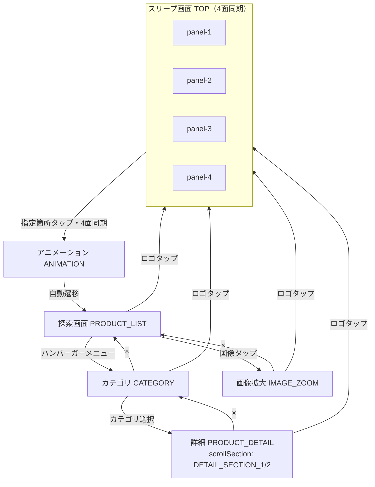

# 画面遷移仕様

## 正（Source of Truth）

| 優先 | ファイル | 役割 |
|------|----------|------|
| 1 | `docs/function.xlsx` | 要件内容の最新版（MUST/SHOULD） |
| 2 | `docs/screen-flow.json` | 画面状態ID・遷移の機械可読定義 |
| 3 | `docs/screen-flow.md` | 本ドキュメント（人間向け説明） |
| 4 | `docs/screen-flow.mmd` | Mermaid 図（ソース） |
| 5 | `docs/screen-flow.png` | 画面遷移図（PNG、`screen-flow.mmd` から生成） |

旧ファイル `screenflow.md` / `screenflow.json` は廃止し、本仕様に統合済み。

## 概要（B案：探索デザイン重視型）

スリープ画面（4枚マルチモニター）から探索体験へ誘導し、探索（カテゴリ・詳細・画像拡大）を回遊する構成。

**必須（納品要件・function.xlsx 外の合意事項）**

- 4面のアニメーション同期再生
- 4台のタッチモニターのいずれか1台で有効操作があった場合、4台すべてで同一状態へ遷移

## 画面状態ID（実装共通）

| 状態ID | 画面名（表示） | 備考 |
|--------|----------------|------|
| `TOP` | スリープ画面 | 4面表示（panel 1〜4） |
| `ANIMATION` | アニメーション_1 | 探索画面遷移前。4面同期必須 |
| `PRODUCT_LIST` | 探索画面 | 旧称: 探索画面 / EXPLORE |
| `CATEGORY` | カテゴリ画面 | |
| `PRODUCT_DETAIL` | 詳細画面 | 詳細-1 / 詳細-2 は別画面ではなく `scrollSection` で管理 |
| `IMAGE_ZOOM` | 画像拡大画面 | モーダル。戻り先は `PRODUCT_LIST` |

### PRODUCT_DETAIL の scrollSection

| scrollSection | 表示名 | 備考 |
|---------------|--------|------|
| `DETAIL_SECTION_1` | 詳細画面-1 | 同一 `PRODUCT_DETAIL` 内のスクロール領域 |
| `DETAIL_SECTION_2` | 詳細画面-2 | 同上。縦スクロールで4セクション程度を包含 |

## Mermaid

## 遷移ルール

- `TOP`（いずれか1台）の指定箇所タップ → `ANIMATION`（4面同期）
- `ANIMATION` 終了 → `PRODUCT_LIST`（自動遷移）
- `PRODUCT_LIST` の画像タップ → `IMAGE_ZOOM`（モーダル）
- `IMAGE_ZOOM` の × → `PRODUCT_LIST`
- `PRODUCT_LIST` のハンバーガーメニュー → `CATEGORY`
- `CATEGORY` の × → `PRODUCT_LIST`
- `CATEGORY` のカテゴリ選択 → `PRODUCT_DETAIL`
- `PRODUCT_DETAIL` の × → `CATEGORY`
- 探索系画面の TRUNK ロゴタップ → `TOP`（共通UI）

## 画面別要件（function.xlsx 抜粋）

### TOP（スリープ画面）

- 4枚マルチモニター表示
- 指定箇所タップ → `ANIMATION`

### ANIMATION

- 探索画面遷移前アニメーション
- 終了後、自動で `PRODUCT_LIST` へ

### PRODUCT_LIST（探索画面）

- 40〜70枚の画像をランダム配置（サイズ不均一・グレースケール）
- スワイプで視点移動（上下左右）
- ピンチでズームイン/アウト
- 画像タップで `IMAGE_ZOOM`（モーダル）
- ハンバーガーメニュー → `CATEGORY`
- 奥から手前へ移動する没入感アニメーション（演出）
- TRUNKロゴ（画像）表示

### IMAGE_ZOOM（画像拡大画面）

- フルスクリーン画像表示
- ×で `PRODUCT_LIST` へ戻る
- TRUNKロゴ（画像）表示

### CATEGORY（カテゴリ画面）

- カテゴリ一覧（テキスト）表示
- タップでカテゴリ選択 → `PRODUCT_DETAIL`
- ×で `PRODUCT_LIST` へ

### PRODUCT_DETAIL（詳細画面）

- 縦スクロールで4セクション程度の情報表示
- Sticky Header ＋ スクロール（画像・テキスト）
- 上下スワイプでスクロール
- ×で `CATEGORY` へ
- TRUNKロゴ（画像）表示
- 詳細画面-1 / 詳細画面-2 は `scrollSection`（`DETAIL_SECTION_1` / `DETAIL_SECTION_2`）として同一画面内で管理

### 共通UI・システム

- TRUNKロゴタップで `TOP` へ戻る
- 画像・動画コンテンツ表示
- 60fps の描画
- 低遅延タッチレスポンス

## 実装メモ

- グローバル状態は `screenState`（上表の状態ID）を正とする
- `PRODUCT_DETAIL` では追加で `scrollSection` を保持する
- 4面同期の配信方式は引き継ぎ書（`docs/handover.md`）の未確定事項を参照
