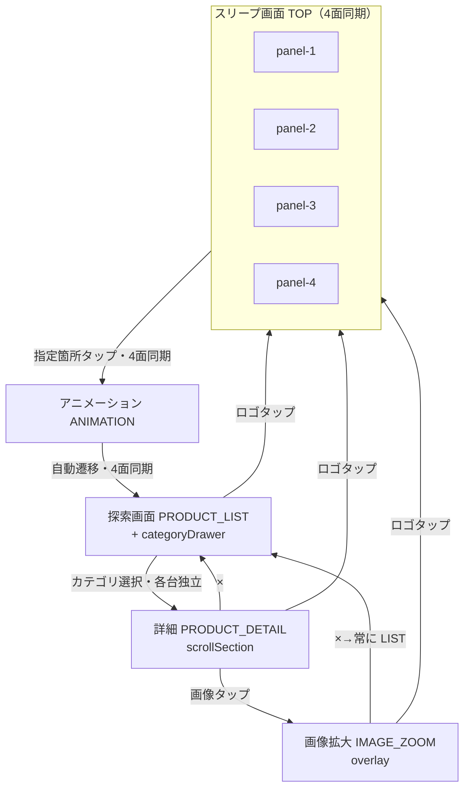

# 画面遷移仕様

## 正（Source of Truth）

| 優先 | ファイル | 役割 |
|------|----------|------|
| 1 | `docs/function.xlsx` | 要件内容の最新版（MUST/SHOULD） |
| 2 | `docs/screen-flow.json` | 画面状態ID・遷移・同期ルールの定義 |
| 3 | `docs/screen-flow.md` | 本ドキュメント（人間向け説明） |
| 4 | `docs/screen-flow.mmd` | Mermaid 図（ソース） |
| 5 | `docs/screen-flow.png` | 画面遷移図（PNG、`screen-flow.mmd` から生成） |

旧ファイル `screenflow.md` / `screenflow.json` は廃止し、本仕様に統合済み。

## 概要（B案：探索デザイン重視型）

スリープ画面（4枚マルチモニター）から探索体験へ誘導し、探索（カテゴリ・詳細・画像拡大）を回遊する構成。

## 画面状態ID（実装共通）

| 状態ID | 画面名（表示） | 備考 |
|--------|----------------|------|
| `TOP` | スリープ画面 | 4面表示（panel 1〜4） |
| `ANIMATION` | アニメーション_1 | 探索画面遷移前。4面同期必須 |
| `PRODUCT_LIST` | 探索画面 | 商品探索一覧 |
| `PRODUCT_DETAIL` | 詳細画面 | 詳細-1 / 詳細-2 は `scrollSection` で管理 |
| `IMAGE_ZOOM` | 画像拡大画面 | overlay UI。状態は独立 screenState |

### CATEGORY の扱い（独立 screenState ではない）

- UX・説明上の名称として **CATEGORY（カテゴリ画面）** を使用してよい
- 実装上は独立 `screenState` ではなく、`PRODUCT_LIST` 上の **右側スライドドロワー**
- `categoryDrawer: open | closed` で管理する

### IMAGE_ZOOM の扱い

- 見た目はモーダル（overlay UI）として `PRODUCT_DETAIL` 上に重ねて表示
- 状態管理上は `screenState: IMAGE_ZOOM` として独立して扱ってよい
- ×ボタンは直前画面へ戻らず、**常に `PRODUCT_LIST` へ遷移**

### PRODUCT_DETAIL の scrollSection

| scrollSection | 表示名 | 備考 |
|---------------|--------|------|
| `DETAIL_SECTION_1` | 詳細画面-1 | 同一 `PRODUCT_DETAIL` 内のスクロール領域 |
| `DETAIL_SECTION_2` | 詳細画面-2 | 同上。縦スクロールで4セクション程度を包含 |

## 4面同期の範囲（確定）

| 範囲 | 挙動 |
|------|------|
| `TOP` → `ANIMATION` → `PRODUCT_LIST` | 4面同期（いずれか1台の有効操作で4台同一遷移） |
| `PRODUCT_LIST` 以降 | 各モニター操作は**独立**（B/C/D で別のお客さんが同時に探索可能） |

## Mermaid

## 遷移ルール

### screenState 遷移

- `TOP`（いずれか1台）の指定箇所タップ → `ANIMATION`（4面同期）
- `ANIMATION` 終了 → `PRODUCT_LIST`（自動遷移・4面同期）
- `PRODUCT_LIST` 上の categoryDrawer でカテゴリ選択 → `PRODUCT_DETAIL`（当該モニターのみ）
- `PRODUCT_DETAIL` の × → `PRODUCT_LIST`（当該モニターのみ）
- `PRODUCT_DETAIL` の画像タップ → `IMAGE_ZOOM`（overlay・当該モニターのみ）
- `IMAGE_ZOOM` の × → `PRODUCT_LIST`（直前復帰なし・当該モニターのみ）
- 探索系画面の TRUNK ロゴタップ → `TOP`（当該モニターのみ）

### uiState（categoryDrawer）

- ハンバーガーメニュー → `categoryDrawer: open`（`PRODUCT_LIST` 上・当該モニターのみ）
- ×ボタン → `categoryDrawer: closed`（当該モニターのみ）

## 画面別要件（function.xlsx 抜粋）

### TOP（スリープ画面）

- 4枚マルチモニター表示
- 指定箇所タップ → `ANIMATION`

### ANIMATION

- 探索画面遷移前アニメーション
- 終了後、自動で `PRODUCT_LIST` へ（4面同期）

### PRODUCT_LIST（探索画面）

- 40〜70枚の画像をランダム配置（サイズ不均一・グレースケール）
- スワイプで視点移動（上下左右）
- ピンチでズームイン/アウト
- ハンバーガーメニューで categoryDrawer（CATEGORY）を開閉
- categoryDrawer からカテゴリ選択 → `PRODUCT_DETAIL`
- 奥から手前へ移動する没入感アニメーション（演出）
- TRUNKロゴ（画像）表示

### PRODUCT_DETAIL（詳細画面）

- 縦スクロールで4セクション程度の情報表示
- Sticky Header ＋ スクロール（画像・テキスト）
- 上下スワイプでスクロール
- ×で `PRODUCT_LIST` へ
- 画像タップで `IMAGE_ZOOM`（overlay）
- TRUNKロゴ（画像）表示

### IMAGE_ZOOM（画像拡大画面）

- `PRODUCT_DETAIL` 上に overlay 表示
- ×で常に `PRODUCT_LIST` へ
- TRUNKロゴ（画像）表示

### 共通UI・システム

- TRUNKロゴタップで `TOP` へ戻る
- 画像・動画コンテンツ表示
- 60fps の描画
- 低遅延タッチレスポンス

## 実装メモ

- グローバル状態は `screenState`（上表の状態ID）を正とする
- `PRODUCT_LIST` では `categoryDrawer` を併用する（CATEGORY は screenState にしない）
- `PRODUCT_DETAIL` では `scrollSection` を保持する
- 4面同期の配信方式は `docs/architecture.md` および `docs/open-questions.md` を参照
