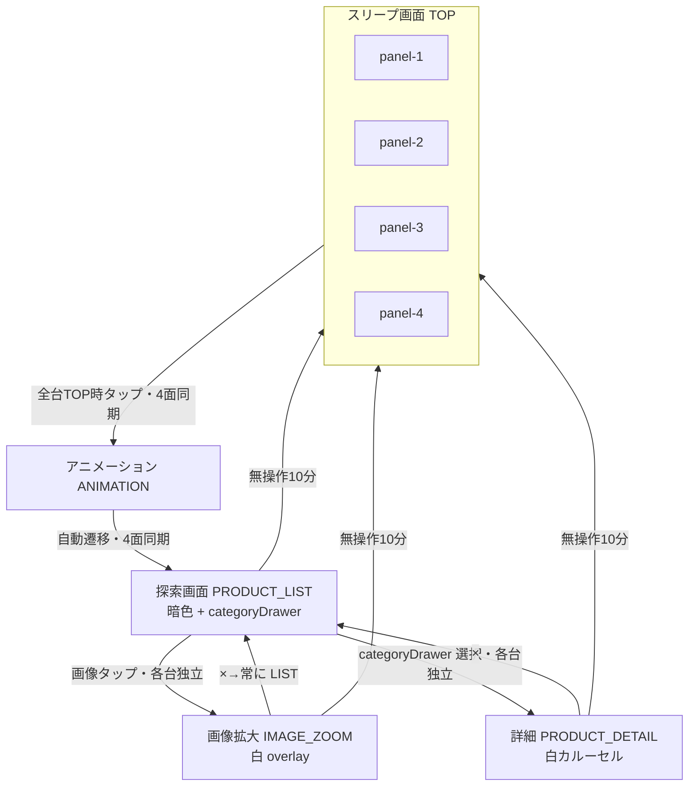

# 画面遷移仕様

## 正（Source of Truth）

| 優先 | ファイル | 役割 |
|------|----------|------|
| 1 | `docs/Design_Check0622.mp4` | **機能挙動の正**（画質は対象外） |
| 2 | `docs/function.xlsx` | 要件内容の最新版（MUST/SHOULD） |
| 3 | `docs/screen-flow.json` | 画面状態ID・遷移・同期ルールの定義 |
| 4 | `docs/screen-flow.md` | 本ドキュメント（人間向け説明） |
| 5 | `docs/screen-flow.mmd` | Mermaid 図（ソース） |
| 6 | `docs/screen-flow.png` | 画面遷移図（PNG、`screen-flow.mmd` から生成） |

旧ファイル `screenflow.md` / `screenflow.json` は廃止し、本仕様に統合済み。

## 概要（B案：探索デザイン重視型）

スリープ画面（4枚マルチモニター）から探索体験へ誘導し、探索（画像拡大・カテゴリ・詳細）を回遊する構成。

## 画面状態ID（実装共通）

| 状態ID | 画面名（表示） | 備考 |
|--------|----------------|------|
| `TOP` | スリープ画面 | 4面表示（panel 1〜4） |
| `ANIMATION` | アニメーション_1 | 探索画面遷移前。4面同期必須 |
| `PRODUCT_LIST` | 探索画面 | 暗色背景・多数の浮遊画像 |
| `IMAGE_ZOOM` | 画像拡大 | 暗色探索背景上の白い overlay/card |
| `PRODUCT_DETAIL` | 詳細画面 | カテゴリ選択後の白い詳細/カルーセル |

### CATEGORY の扱い（独立 screenState ではない）

- UX・説明上の名称として **CATEGORY（カテゴリ画面）** を使用してよい
- 実装上は独立 `screenState` ではなく、`PRODUCT_LIST` 上の **右側スライドドロワー**
- `categoryDrawer: open | closed` で管理する

### IMAGE_ZOOM の扱い

- `PRODUCT_LIST`（暗色探索画面）の上に、白い overlay/card として重ねて表示
- 状態管理上は `screenState: IMAGE_ZOOM` として独立して扱ってよい
- トリガーは **PRODUCT_LIST 上の画像タップ**（PRODUCT_DETAIL からではない）
- ×ボタンは直前画面へ戻らず、**常に `PRODUCT_LIST` へ遷移**

### PRODUCT_DETAIL の scrollSection

| scrollSection | 表示名 | 備考 |
|---------------|--------|------|
| `DETAIL_SECTION_1` | 詳細画面-1 | 同一 `PRODUCT_DETAIL` 内のスクロール領域 |
| `DETAIL_SECTION_2` | 詳細画面-2 | 同上 |

### TRUNK ロゴ

- 装飾画像として表示するのみ
- **クリック/タップハンドラを付けない**
- ロゴタップによる `TOP` 復帰は**廃止**

## 4面同期の範囲（確定）

| 範囲 | 挙動 |
|------|------|
| `TOP` → `ANIMATION` → `PRODUCT_LIST` | 4面同期 |
| `TOP` → `ANIMATION` の条件 | **4台すべてが `TOP` のときのみ**4面同期を発火 |
| 1台のみ `TOP` | 無操作タイムアウト等で当該台だけ `TOP` にいる場合、再開操作は**他台を中断しない** |
| `PRODUCT_LIST` 以降 | 各モニター操作は**独立** |

## 無操作タイムアウト（確定）

| 項目 | 内容 |
|------|------|
| 時間 | **10分**（600秒） |
| 対象 | `PRODUCT_LIST` / `PRODUCT_DETAIL` / `IMAGE_ZOOM` |
| 挙動 | **当該モニターのみ** `TOP` へ復帰 |
| 他台への影響 | なし（グローバル同期を発火しない） |
| 操作リセット | **タップ・スワイプ・ピンチ・スクロール**は操作とみなし、タイムアウトカウントを再スタート |

## Mermaid

## 遷移ルール

### screenState 遷移

- `TOP` 指定箇所タップ → `ANIMATION`（**4台すべて `TOP` のときのみ**4面同期）
- `ANIMATION` 終了 → `PRODUCT_LIST`（自動遷移・4面同期）
- `PRODUCT_LIST` 画像タップ → `IMAGE_ZOOM`（overlay・当該モニターのみ）
- `IMAGE_ZOOM` × → `PRODUCT_LIST`（直前復帰なし・当該モニターのみ）
- `PRODUCT_LIST` categoryDrawer でカテゴリ選択 → `PRODUCT_DETAIL`（当該モニターのみ）
- `PRODUCT_DETAIL` × → `PRODUCT_LIST`（当該モニターのみ）
- 無操作10分（`PRODUCT_LIST` / `PRODUCT_DETAIL` / `IMAGE_ZOOM`）→ `TOP`（**当該モニターのみ**）

### uiState（categoryDrawer）

- ハンバーガーメニュー → `categoryDrawer: open`（`PRODUCT_LIST` 上・当該モニターのみ）
- ×ボタン → `categoryDrawer: closed`（当該モニターのみ）

### 廃止した遷移

- ~~TRUNK ロゴタップ → `TOP`~~（全画面）
- ~~1台のみ `TOP` からの操作で他台を同期~~

## 画面別要件（Design_Check0622.mp4 + function.xlsx）

### TOP（スリープ画面）

- 4枚マルチモニター表示
- 全台 `TOP` 時の指定箇所タップ → `ANIMATION`（4面同期）

### ANIMATION

- 探索画面遷移前アニメーション
- 終了後、自動で `PRODUCT_LIST` へ（4面同期）

### PRODUCT_LIST（探索画面）

- 暗色背景に多数の浮遊画像（40〜70枚想定）
- スワイプで視点移動（上下左右）
- ピンチでズームイン/アウト
- **画像タップ → `IMAGE_ZOOM`**（白 overlay）
- ハンバーガーメニュー → categoryDrawer（CATEGORY）を右側に開く
- categoryDrawer からカテゴリ選択 → `PRODUCT_DETAIL`
- TRUNK ロゴ（装飾のみ・タップ不可）
- 無操作10分 → `TOP`（当該台のみ）

### IMAGE_ZOOM（画像拡大）

- 暗色探索背景の上に白い overlay/card
- ×で常に `PRODUCT_LIST` へ
- TRUNK ロゴ（装飾のみ・タップ不可）
- 無操作10分 → `TOP`（当該台のみ）

### PRODUCT_DETAIL（詳細画面）

- カテゴリ選択後の白い詳細/カルーセル画面
- ×で `PRODUCT_LIST` へ
- TRUNK ロゴ（装飾のみ・タップ不可）
- 無操作10分 → `TOP`（当該台のみ）

### 共通UI・システム

- 画像・動画コンテンツ表示
- 60fps の描画
- 低遅延タッチレスポンス

## 実装メモ

- グローバル状態は `screenState`（上表の状態ID）を正とする
- `PRODUCT_LIST` では `categoryDrawer` を併用する（CATEGORY は screenState にしない）
- `PRODUCT_DETAIL` では `scrollSection` を保持する
- 4面同期の配信方式は `docs/architecture.md` を参照
- 機能挙動の最終確認は `Design_Check0622.mp4` を参照
